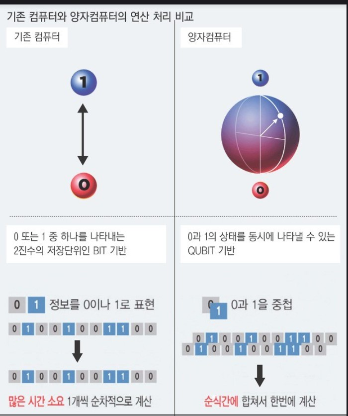

# QuantumComputerProject_OS

## 수강 정보
- COMP312001 운영체제/2020 1월 계절학기(2019W)/ 경북대학교 배준현 교수님

---

## 프로젝트 주제 

- 양자 컴퓨팅을 이용한 소인수분해 알고리즘 프로젝트

## 프로젝트 내용 

- 양자 역학의 얽힘(Entanglement)과 중첩(Superposition) 두가지 특징을 통해 기존 컴퓨터의 계산 패러다임을 깨부수기 위해 IBM에서 발표한 양자컴퓨팅 SW Tool인 (Qiskit)[https://qiskit.org/] 을 이용해서 소인수분해를 양자 컴퓨팅의 패러다임에서 프로젝트를 통해 구현해 보고 현존하는 가장 뛰어난 성능의 양자컴퓨터 소인수분해 알고리즘인 Deutsch-Algorithm , Deutsch-Josza Algorithm, Grover's Algorithm, Shor's Algorithm을 조사하는 프로젝트를 다뤄보았다. 

이 저장소에는 본인이 구현한 Shor 알고리즘의 코드를 함께 다뤄 보았다.

---

# 양자컴퓨터와 양자 컴퓨팅 알고리즘 알아보기

---

## 1. 양자 컴퓨팅의 세계(Quantum Computing!)

양자컴퓨터는 “꿈의 컴퓨터”, “스스로 생각하는 계산기”라는 별칭을 가진 새로운 개념의 계산 기계다. 최초의 이론 도입은 양자물리학의 기초적인 이론 체계가 확립된 1980년대 초반 R. Feynman(미국의 물리학자)이 아이디어를 제안하였다. 반도체 기술의 발전으로 컴퓨터 기술 또한 급격한 발전을 이루었고 이에 따라 대량의 데이터 처리, 실험 제어 및 복잡한 양자 시스템의 계산이 가능해졌다. 그러나 기존 고전 역학에 기반을 두고 있는 디지털 논리 회로는 중첩 상태를 저장하고 있는 양자물리학 문제에서 메모리 공간과 계산 시간의 한계에 부딪혔다. 

디지털 논리 회로에 기반하는 기존 컴퓨터 메모리는 0 또는 1 둘 중 하나의 값만 저장할 수 있는데 양자 역학에서 다루는 얽힘(entanglement), 중첩(superposition) 현상, 즉 0과 1이 동시에 존재하는 상태를 해결할 수 없기 때문이다, 전문가들은 큐비트를 처리할 수 있는 양자 컴퓨터 구현에 성공한다면 현존하는 슈퍼컴퓨터들이 수백 년이 걸려도 풀기 힘든 문제를 단시간에 풀 것이며 양자컴퓨팅이 중요한 컴퓨팅 문제를 해결하고자 하는 기업에 중요한 전환점이 되리라 예측한다. 

예를 들어 기상청 같은 곳에서 이러한 양자 시스템이 사용된다면, 좀 더 빠른 계산과 정확한 결과를 도출해 낼 수 있을 것이다. 또한, 약물 및 생명공학 연구, 시뮬레이션, 인공 지능, 암호학, 패턴 분석 등 다양한 분야에서 유용하게 운용될 것으로 전망된다. 이에 따라 전 세계 과학기술원들과 IBM, Microsoft, Intel, Google 등에서 다양한 실험과 연구로 개발을 위해 노력하고 있다.

---

## 2. Quantum Algorithms  
   * Deutsch Algorithm (도이치 알고리즘)
   * Deutsch-Jozsa Algorithm(도이치 조사 알고리즘)
   * Grover's Algorithm(그로버 알고리즘)
   * Shor's Algorithm(쇼어 알고리즘)

-Quantum Algorithm의 특징: 
    1. 상용화 될 정도의 수준으로 개발되지 못했고 굉장히 저수준의 상태가 양자컴퓨터의 현 상황이다.(최초의 컴퓨터가 엄청나게 컸듯이) 
    2. 그러나 도이치알고리즘,쇼어알고리즘 등의 이 양자 알고리즘은 비트 기반의 슈퍼컴퓨터보다 더 빠른 계산이 가능하다고 알려져 있어서 양자 컴퓨팅 수준이 높아지고 상용화가 되면 컴퓨터 연산의 패러다임이 바뀔것이다.

이제 양자 알고리즘이 무엇인지 PPT자료를 통해 함께 알아보자. 

---

### Deutsch Algorithm 

- 도이치 알고리즘은 양자 회로를 구성하여 양자 역학의 특성을 큐비트로 구현하여 항상 f(0)=f(1)인지를 판별하는 balanced문제를 정통컴퓨팅 연산 없이 양자 컴퓨팅으로 해결해줌. 

- 그러나 이 기능의 사용/응용분야가 거의 없기때문에 도이치 알고리즘은 양자컴퓨터를 사용한 최초의 알고리즘 격으로 의의를 둔다. 

---

### Grover's Algorithm

- 그로버 알고리즘은 정렬되지 않은 데이터베이스를 양자 회로와 큐비트를 이용해서 선형시간(빅오 of 루트N) 내에 검색해주는 특정 데이터 탐색 알고리즘이다. 1996년에 고안되었으며, 현대에 이 알고리즘이 양자컴퓨터 성능이 발전해서 최적화된다면 현재의 대칭키 안정성을 더이상 보장할 수 없다는 의견이 있다. 수학적으로는 학률적(probabilistic)인 알고리즘이며, brute-force의 속도 향상에 쓰일 수 있으며, 어떤 number Set의 average, mean, median 추정에도 쓰일 수 있다.

---

### Shor's Algorithm 

- 쇼어 알고리즘은 큰 수를 인수분해하는데 양자컴퓨터가 일반컴퓨터보다 우수하다는 이론에서 착안된 양자회로,큐비트 기반의 양자알고리즘이다. 상용화되기 위해서는 많은 큐비트의 양이 필요한데 이는 오랜 세월이 걸리겠지만, 쇼어알고리즘이 상용화 되게 된다면, 큰수를 두개의 소수로 분해하는 난해한 문제를 해결하여, 기존의 RSA 암호학을 모조리 깨부술 수 있기에 엄청난 연구 가치를 지니고 있다. Python 기반으로 현재 상용화가 가능한 작은 수 15를 인수분해 해보았다.

---

## [코드]

### 쇼어 알고리즘을 구현한 코드 

▶[코드 보기](https://github.com/purang2/OS_QuantumComputing/blob/main/%5B%ED%92%80%EC%BD%94%EB%93%9C%5DShor_Algorithm_QuantumComputing.py)

- 코드 주석에 설명을 달아 두었습니다. 양해부탁드립니다. 

